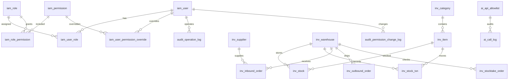

# 实体关系图

```mermaid
erDiagram
  iam_user ||--o{ iam_user_role : has
  iam_role ||--o{ iam_user_role : assigned
  iam_role ||--o{ iam_role_permission : grants
  iam_permission ||--o{ iam_role_permission : included
  iam_user ||--o{ iam_user_permission_override : overrides
  iam_permission ||--o{ iam_user_permission_override : overridden

  inv_category ||--o{ inv_item : contains
  inv_supplier ||--o{ inv_inbound_order : supplies
  inv_warehouse ||--o{ inv_stock : stores
  inv_item ||--o{ inv_stock : stocked
  inv_item ||--o{ inv_stock_txn : moves
  inv_warehouse ||--o{ inv_stock_txn : records
  inv_warehouse ||--o{ inv_inbound_order : receives
  inv_warehouse ||--o{ inv_outbound_order : ships
  inv_warehouse ||--o{ inv_stocktake_order : checks

  iam_user ||--o{ audit_operation_log : operates
  iam_user ||--o{ audit_permission_change_log : changes
  ai_api_allowlist ||--o{ ai_call_log : audits
```
