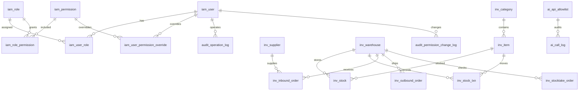
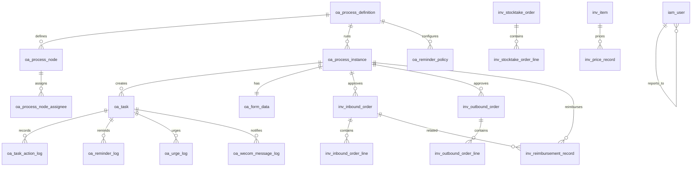

# 实体关系图

```mermaid
erDiagram
  iam_user ||--o{ iam_user_role : has
  iam_role ||--o{ iam_user_role : assigned
  iam_role ||--o{ iam_role_permission : grants
  iam_permission ||--o{ iam_role_permission : included
  iam_user ||--o{ iam_user_permission_override : overrides
  iam_permission ||--o{ iam_user_permission_override : overridden

  inv_category ||--o{ inv_item : contains
  inv_supplier ||--o{ inv_inbound_order : supplies
  inv_warehouse ||--o{ inv_stock : stores
  inv_item ||--o{ inv_stock : stocked
  inv_item ||--o{ inv_stock_txn : moves
  inv_warehouse ||--o{ inv_stock_txn : records
  inv_warehouse ||--o{ inv_inbound_order : receives
  inv_warehouse ||--o{ inv_outbound_order : ships
  inv_warehouse ||--o{ inv_stocktake_order : checks

  iam_user ||--o{ audit_operation_log : operates
  iam_user ||--o{ audit_permission_change_log : changes
  ai_api_allowlist ||--o{ ai_call_log : audits
```

## 第一阶段扩展关系

```mermaid
erDiagram
  iam_user ||--o{ iam_user : reports_to
  oa_process_definition ||--o{ oa_process_node : defines
  oa_process_node ||--o{ oa_process_node_assignee : assigns
  oa_process_definition ||--o{ oa_process_instance : runs
  oa_process_instance ||--o{ oa_task : creates
  oa_task ||--o{ oa_task_action_log : records
  oa_process_instance ||--|| oa_form_data : has
  oa_process_definition ||--o{ oa_reminder_policy : configures
  oa_task ||--o{ oa_reminder_log : reminds
  oa_task ||--o{ oa_urge_log : urges
  oa_task ||--o{ oa_wecom_message_log : notifies

  inv_inbound_order ||--o{ inv_inbound_order_line : contains
  inv_outbound_order ||--o{ inv_outbound_order_line : contains
  inv_stocktake_order ||--o{ inv_stocktake_order_line : contains
  inv_item ||--o{ inv_price_record : prices
  oa_process_instance ||--o{ inv_inbound_order : approves
  oa_process_instance ||--o{ inv_outbound_order : approves
  oa_process_instance ||--o{ inv_reimbursement_record : reimburses
  inv_inbound_order ||--o{ inv_reimbursement_record : related
```
