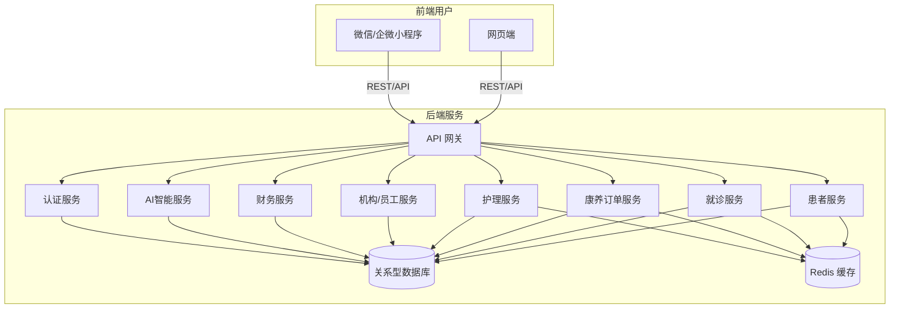
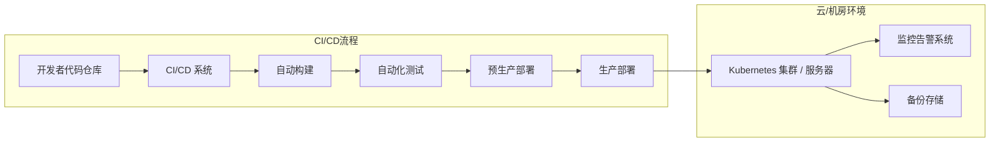

# HIS 与康养服务系统技术架构报告

## 执行摘要  
本报告面向医院信息系统（HIS）与康养服务系统，结合项目需求与约束，提出全面的技术架构方案。方案支持在 Windows/Linux、局域网/云端多环境下部署，采用微服务解耦医院业务与康养业务模块，共用统一账号体系，并原生支持AI大模型接入。前端采用简洁的网页和微信/企业微信小程序设计，优化加载与离线访问；后端采用Spring Cloud微服务架构，基于API网关进行统一鉴权与限流；数据库主用关系型存储，必要时辅以NoSQL缓存和消息队列，并设计分库分表与索引策略。AI接入层设计了严格的权限和能力分层，使用沙箱隔离执行风险。部署方面，提供一键打包（Docker）方案，兼顾容器化与传统安装，支持局域网离线与主流云平台部署，配合CI/CD流水线和监控告警。数据模型规划了患者、就诊、护理、康养订单、上门服务、机构、员工、账单、权限等核心表结构，提供字段示例及索引设计。接口清单列出核心REST接口及权限、速率限制示例。安全设计涵盖传输加密、存储加密、身份认证、审计记录、AI使用限制等合规要点。最后给出实施路线和硬件预算建议，为后续开发与运维提供详实参考。

## 1. 高层目标与非功能需求  
- **业务目标**：建设原生支持AI的大型医院信息系统，同时拓展康养到家服务，线上接入本地康养机构与用户，实现线上点单、线下服务闭环。  
- **系统可部署性**：支持多平台部署。在Windows和Linux上均可部署主系统，可使用Docker容器化方案，一键安装（）。支持部署在本地局域网，也可部署至云端（AWS、阿里云、腾讯云等）；各子系统（HIS模块、康养模块）可独立部署，降低耦合度。  
- **共用账户体系**：医院与康养系统共享账号体系，采用统一身份认证（如 OAuth2/OIDC），实现SSO登录管理。账号分为患者、护理员、医生、管理员等角色，后端可基于RBAC细化权限控制。  
- **性能与可扩展性**：面向高并发需求，采用微服务架构，业务模块独立可弹性伸缩，满足挂号、缴费等高峰并发（见Section 2），具有故障隔离特性。前端需针对低端设备与慢网速优化：尽量简化页面结构、压缩资源、分包加载，避免一次性加载大量数据，使用CDN加速静态资源。后端设计需充分考虑并发场景，例如使用Nginx/HAProxy等负载均衡，多线程服务。  
- **低端设备友好**：前端移动端采用微信/企业微信小程序，针对老旧手机进行性能优化：采用分包加载技术减小启动包体积（实践中可缩减90%以上、提升启动30%），图片与静态资源进行压缩与懒加载。网页端避免使用过重动画，提供基础浏览器支持。整体界面保持简洁、响应式布局。  
- **AI原生支持与安全约束**：从设计之初即预留AI接入层和丰富接口，满足调用大模型的需求。所有核心业务接口（患者信息、就诊记录、护理日志、康养订单等）都需有明确的API文档、接口说明和权限控制。AI模型只能通过受控的能力层访问系统，仅具备只读查询或受限写入权限，避免未经授权的修改操作。同时设计模型沙箱与日志审计，满足隐私合规要求（见Section 3）。  

## 2. 技术架构设计  

### 2.1 前端架构  
- **双端设计**：前端分为“网页端”和“移动端”。网页端推荐使用轻量化的前端框架（如Vue.js或React）开发管理后台和用户门户，适当采用SSR/CSR方案。移动端采用微信小程序和企业微信小程序开发用户端及护理员端，实现线上点单、预约管理等功能。可考虑使用UniApp、Taro等跨端框架统一部分代码。  
- **性能优化**：使用CDN分发静态资源（JS、CSS、图片等），减轻服务器压力，加快加载速度。图片使用WebP等高效格式并进行压缩，关键资源启用Gzip/Brotli压缩。采用代码分片（Webpack拆包）和懒加载技术，减少首屏资源体积（如将康养服务模块独立分包）。设立前端资源缓存策略，针对不常变动资源配置合理缓存策略（Cache-Control）。  
- **离线支持**：网页端可做PWA支持，利用Service Worker缓存必要静态文件和部分数据，实现离线或弱网情况下访问。微信小程序本身支持一定离线缓存，可以使用小程序的Storage缓存接口数据。移动端可提供断线后自动重试和本地缓存策略，确保不掉单。  
- **统一网关**：所有前端请求都通过API网关转发，网关可用于静态资源托管、统一鉴权和限流。  

### 2.2 后端架构  
- **微服务划分**：后端采用Spring Boot+Spring Cloud或类似微服务框架，按照业务划分服务模块，例如：患者管理服务、就诊管理服务、药品管理服务、财务管理服务、护理记录服务、康养订单服务、上门服务派单服务、机构与员工管理服务等。每个服务独立部署，服务之间通过REST/HTTP或消息队列（RabbitMQ/Kafka）通信。微服务架构提供弹性伸缩和故障隔离能力。  
- **服务注册与发现**：使用Eureka/Nacos等注册中心管理各服务实例；API网关（Spring Cloud Gateway或Zuul）作为统一入口负责路由转发请求、认证鉴权和限流。配置中心（如Spring Cloud Config或Apollo）管理各服务配置，支持动态刷新。  
- **鉴权与权限模型**：前端登录获取JWT Token，后续请求带Token。网关或单独的认证服务负责验证Token并注入用户身份。内部微服务在API网关或微服务网关层实现统一权限检查（基于用户角色/RBAC）。权限粒度包括：系统管理员、医院管理员、医生、护士、护理员、财务、普通患者等，不同角色可访问不同资源，详见接口权限矩阵。敏感操作需二次校验（如财务修改）。  
- **审计与日志**：所有服务均开启审计日志，记录关键操作（如数据创建、修改、删除）及谁执行了操作。使用Elasticsearch+Kibana或Aliyun SLS等实现日志收集与审计。业务日志和访问日志分开存储，定期归档备份。  
- **接口限流**：API网关实现速率限制和熔断策略。可配置对登录、下单、查询等接口设定最大QPS/QPM，防止暴力刷取或DDOS攻击。限流策略可以按IP、用户ID或应用维度进行，比如每个用户登录接口10次/分钟的限制。  

### 2.3 数据库架构  
- **关系型数据库**：核心业务数据使用关系数据库（如MySQL、PostgreSQL、国产GaussDB或OceanBase）。每个微服务拥有独立数据库实例，实现真正的物理解耦。数据表结构设计规范化，尽量避免冗余，使用外键保持数据一致性。对高读场景可使用读写分离。  
- **NoSQL缓存与消息队列**：使用Redis做缓存层和会话存储，提高热点数据访问速度。使用RabbitMQ或Kafka做异步消息队列，处理高并发下的数据同步、异步通知（如开处方后异步更新库存、异步发送提醒等），缓解数据库压力。对于全文检索或日志分析，可引入Elasticsearch。  
- **分库分表**：针对潜在的大规模数据（如患者历史记录、日志等），可使用水平分库或分表策略。例如按医院或按年份分表。对于多租户场景，机构或地区可作为分片键，数据库连接池需配置充足。  
- **索引策略**：核心表需建立主键索引。常用查询字段（如患者姓名、身份证号、病历号；订单状态、时间戳；机构ID等）建立适当的二级索引。对于联查频繁的字段可建立联合索引。需注意避免过多索引带来写入压力。表字段和索引在设计文档中详细说明，确保开发时可快速定位。  
- **备份与本地部署方案**：所有关系库配置定期自动备份，支持全量与增量备份，并有自动恢复机制（可参考阿里云本地备份解决方案）。在局域网离线部署时，提供离线安装包和本地备份恢复方案，以便断网环境下快速恢复（如数据库镜像、冷备分发等）。  

## 3. AI接入设计  
- **AI模型接入层**：设计专门的AI服务层，用于连接大语言模型（LLaMA、GPT等）或本地AI平台。前端或后端业务逻辑可调用AI服务处理自然语言查询、报告生成、决策辅助等场景。所有模型访问均通过受控接口（API Gateway）进行。  
- **能力分层**：给AI模型分配有限权限。**查询只读**：模型只能查询开放的数据接口，如患者基本信息、病历摘要、健康知识库等。**受限调用**：对写操作（如创建订单、修改记录）需严格授权，模型通常不具备此能力；若需要，可以在后台有人审核后执行。接口层在调用时检查权限，模型角色仅有专用权限（例如`AI_QUERY`）。  
- **接口规范**：所有AI可调用的业务接口都需要制定清晰的OpenAPI/Swagger或GraphQL schema文档，包括输入输出字段说明、示例等，方便模型利用提示词进行正确调用。对外接口需严格验证输入合法性，防止注入攻击或越权请求。  
- **模型沙箱**：对于AI生成的代码或自动执行操作场景（如智能助手调用内部工具、执行脚本等），应在沙箱环境中运行。沙箱提供硬隔离的执行环境（可采用轻量级虚拟机技术如Firecracker），确保代码运行时的CPU、内存、网络、文件系统等受到严格控制。每个AI会话在独立容器/微VM中运行，结束后自动销毁，避免数据泄露。沙箱机制确保如果模型执行错误或生成恶意代码，也不会影响主系统安全。  
- **隐私与合规**：医疗数据涉及敏感个人信息。AI系统必须遵循隐私保护原则：不记录不必要的对话内容，不泄露身份识别字段。可以对输入输出进行脱敏处理（如屏蔽身份证号、联系方式）。AI服务与后台数据库间的通信全程加密，且仅开放必要字段。业务上符合《个人信息保护法》和相关医疗数据安全规范（如使用SSL/TLS加密传输，存储加密）。  
- **日志与可解释性**：所有AI交互都应做详细日志（AI遥测）以便审计。日志包括用户提问、模型返回结果、调用的接口、时间戳等。必要时，保留对话上下文。对关键建议输出，保留可解释信息，比如命中哪个知识库或逻辑路径，确保可追溯。权限最低的人工监督岗位定期复核AI建议，保证结果合规、安全。  

## 4. 部署与运维  
- **一键打包部署**：为Windows和Linux提供统一的部署包。可采用Docker容器化：编写Dockerfile和Docker Compose/Kubernetes清单文件，实现按需启动各组件。Windows开发环境可开启Hyper-V或WSL以运行Docker，生成镜像后部署到Linux服务器。也可提供传统安装脚本（如JAR包+配置）供不使用容器的场景。  
- **容器化与非容器化方案**：推荐使用Docker或容器编排平台（Kubernetes）实现弹性扩容和高可用部署。对于不便使用容器的客户（部分医院局域网环境），提供传统安装程序和手动配置指南。设计时保证两者可切换，容器化主要用于云端和新部署。  
- **局域网离线部署步骤**：提供完整离线安装包（包含应用程序、数据库镜像、依赖软件）。部署文档详细说明环境准备：网络规划、交换机配置、服务器安装数据库，加载离线镜像和应用包。集成监控和备份客户端，确保离线环境下也能进行日志采集和本地备份。  
- **云部署参考**：提供在AWS、Aliyun等主流云平台的部署参考架构图（如使用ECS/EKS或云服务器+容器服务）。利用云监控（CloudWatch、云监控）和存储（OSS/S3）集成，便于弹性扩展与灾备。  
- **CI/CD 流水线**：采用Jenkins、GitLab CI或GitHub Actions等构建流水线。代码提交触发构建、单元测试、打包Docker镜像、发布到镜像仓库，并自动化部署到测试环境。支持分支治理、变更审批和自动回滚。  
- **监控与告警**：后端服务嵌入Prometheus指标（CPU、内存、QPS、错误率等）和Spring Boot Actuator指标，对外暴露监控数据。前端错误可收集到Sentry或类似平台。搭配Grafana或云监控画出仪表盘，并设置阈值告警（如错误率、响应慢、磁盘空间不足等），及时邮件/短信或钉钉通知运维。  
- **灾备与高可用**：生产环境至少两台主机（或Pod）部署关键服务，数据库做主从或集群配置。设置负载均衡自动切换。定期演练灾难恢复，验证备份可用。  

## 5. 数据模型与表结构  

以下列出核心业务域的示例表结构及说明（部分字段简化示例）：  

| 表名           | 主键 (PK)       | 主要字段示例                                    | 索引与约束            | 说明                      |
| -------------- | --------------- | ----------------------------------------------- | --------------------- | ------------------------- |
| `Patient`      | `patient_id`    | `name` (姓名), `gender`, `dob` (出生日期), `id_no`(身份证号), `contact` | `idx_name` (姓名), `uniq_id_no` (身份证号) | 患者基本信息表           |
| `Visit`        | `visit_id`      | `patient_id` (FK), `visit_time`, `department`, `doctor_id`, `status`     | `idx_patient_id`, `idx_status` | 就诊记录表（每次就诊信息） |
| `NursingRecord`| `record_id`     | `visit_id` (FK), `nurse_id`, `note`, `timestamp`      | `idx_visit_id`        | 护理记录/护理日志表      |
| `CareOrder`    | `order_id`      | `patient_id`, `service_type`(护理/陪护), `schedule_date`, `status`       | `idx_patient_id`, `idx_status` | 康养服务订单表           |
| `HomeService`  | `service_id`    | `order_id` (FK), `caretaker_id`, `visit_date`, `result`                   | `idx_order_id`        | 上门服务记录表           |
| `Institution`  | `inst_id`       | `name`, `type`, `address`, `contact`                  | `uniq_inst_name`      | 康养服务机构信息表       |
| `Employee`     | `emp_id`        | `name`, `role`, `inst_id` (FK), `phone`, `email`       | `idx_inst_id`, `uniq_email` | 员工/护理员信息表       |
| `Invoice`      | `invoice_id`    | `patient_id`, `amount`, `bill_date`, `paid_status`   | `idx_patient_id`, `idx_bill_date` | 账单/发票表           |
| `UserAccount`  | `user_id`       | `username`, `password_hash`, `role`, `email`          | `uniq_username`, `idx_role` | 系统用户/账户表        |
| `Permission`   | `perm_id`       | `role`, `resource`, `action`, `description`           | `idx_role`            | 角色权限映射表         |
| `Appointment`  | `appt_id`       | `patient_id`, `doctor_id`, `appt_time`, `status`      | `idx_patient_id`, `idx_doctor_id` | 预约挂号表             |
| *……其他表*      |                 |                                                   |                       |                           |

*说明：* 每张表中均应为字段添加注释，明确数据含义；主键自动递增或UUID；索引遵循“最左前缀”原则。根据业务需要可再增如`Payment`、`Inventory`、`Report`等表，所有表字段、主键、外键和索引将在详细设计文档中完整说明，便于开发复用。  

## 6. 核心接口清单与权限矩阵  

下表列出部分关键REST接口示例（可根据需要增补GraphQL形式的组合查询接口），包括输入输出及权限等级与速率限制示例：  

| 接口 (REST/HTTP)            | 方法  | 描述                      | 输入 (JSON)                                                    | 输出 (JSON)                   | 权限角色               | 速率限制 (QPS/QPM)           |
| ------------------------- | ----- | ------------------------- | ------------------------------------------------------------- | ---------------------------- | ------------------ | ----------------------- |
| `/api/auth/login`         | POST  | 用户登录获取JWT令牌        | `{ "username": "...", "password": "..." }`                    | `{ "token": "...", "roles": ["..."] }` | 无需登录 (匿名)         | 5 QPS (100 QPM)         |
| `/api/patients`           | GET   | 查询患者列表              | `?page=...&size=...`                                          | `[{ patient }]`             | 医院管理员, 医生, 护士 | 50 QPS (3000 QPM)        |
| `/api/patients`           | POST  | 创建新患者档案            | `{ "name":"...", "gender":"...", "dob":"...", ... }`           | `{ "patient_id": ... }`      | 医院管理员, 护理员      | 10 QPS (600 QPM)         |
| `/api/patients/{id}`      | GET   | 查询指定患者信息          | -                                                             | `{ patient }`               | 医院管理员, 医生, 护士, 本人 | 50 QPS (3000 QPM)        |
| `/api/visits`             | GET   | 查询就诊记录              | `?patient_id=...&start=...&end=...`                            | `[{ visit }]`               | 医院管理员, 医生, 护士 | 50 QPS (3000 QPM)        |
| `/api/visits`             | POST  | 创建就诊记录              | `{ "patient_id":..., "department":"...", "doctor_id":..., ...}` | `{ "visit_id": ... }`       | 医院管理员, 医生        | 10 QPS (600 QPM)         |
| `/api/nursing-records`    | GET   | 查询护理记录              | `?visit_id=...`                                                | `[{ record }]`              | 护理员, 医院管理员       | 30 QPS (1800 QPM)        |
| `/api/nursing-records`    | POST  | 提交护理记录              | `{ "visit_id":..., "nurse_id":..., "note": "...", ... }`        | `{ "record_id": ... }`      | 护理员                   | 20 QPS (1200 QPM)        |
| `/api/care-orders`        | GET   | 查询康养订单列表          | `?user_id=...&status=...`                                      | `[{ order }]`               | 医院管理员, 护理员, 用户   | 30 QPS (1800 QPM)        |
| `/api/care-orders`        | POST  | 创建康养服务订单          | `{ "patient_id":..., "service_type":"...", "schedule_date":"..." }` | `{ "order_id": ... }`      | 用户, 医院管理员, 护理员   | 10 QPS (600 QPM)         |
| `/api/home-services`      | GET   | 查询上门服务记录          | `?order_id=...&status=...`                                     | `[{ service }]`             | 医院管理员, 护理员       | 20 QPS (1200 QPM)        |
| `/api/institutions`       | GET   | 查询康养机构列表          | `?type=...&location=...`                                       | `[{ institution }]`         | 医院管理员, 护理员       | 10 QPS (600 QPM)         |
| `/api/employees`          | GET   | 查询员工列表              | `?inst_id=...`                                                 | `[{ employee }]`            | 医院管理员             | 10 QPS (600 QPM)         |
| `/api/billing`            | GET   | 查询账单/发票             | `?patient_id=...&date=...`                                     | `[{ invoice }]`            | 财务人员, 医院管理员    | 20 QPS (1200 QPM)        |
| `/api/ai/query`           | POST  | AI问答/查询接口           | `{ "user_id":..., "query": "..." }`                             | `{ "answer": "...", "sources": [...] }` | 已登录用户              | 5 QPS (300 QPM)          |

*说明：* 表中示例为权限粗粒度，可以进一步细分。速率限制依据接口复杂度与并发压力制定，上表仅为示例，实际项目应结合流量预估调整。需要后续确认的参数包括：具体并发QPS、单用户请求峰值、数据量规模等。

## 7. 安全与合规要点  
- **传输安全**：所有客户端与服务端通信采用HTTPS（TLS 1.2/1.3）加密传输，所有API接口仅在加密通道下可访问。内部微服务调用可使用HTTPS或内网专线加密。  
- **存储加密**：数据库敏感字段（如身份证号、联系方式）采用加密存储，采用AES-256等对称加密算法。数据库服务器数据磁盘启用整体加密。备份文件在存储介质上加密，传输到外部备份库前使用加密隧道。  
- **身份认证**：采用强密码策略与多因素认证（MFA）保护高权限账户。推荐使用OAuth2/OpenID Connect集成企业身份管理（如LDAP/AD或云端IAM），并进行定期口令强度检测。  
- **访问控制**：后端严格实施角色权限模型（RBAC），敏感操作需具备相应角色。对外开放接口进行权限校验，避免水平/垂直越权。部署时将微服务部署在受信任网络边界内，启用防火墙和安全组控制网络访问。根据《医院信息系统安全等级保护基本要求》，建议至少将系统部署在三级安全区域，并启用入侵检测系统（IDS）监测可疑行为。  
- **审计与监控**：记录所有重要操作审计日志，并对系统异常行为告警。配合AI使用，需开启AI活动监控（AI遥测），追踪模型使用情况和系统调用，确保输出合规。  
- **AI使用限制**：大模型不得访问未授权的数据；对模型输出进行敏感词过滤与人工审核。对模型所调用的外部信息源或大模型API进行安全审查（如OpenAI已推出符合医疗HIPAA的接口）。  
- **法规合规**：遵循《网络安全法》《个人信息保护法》《医疗数据安全规范》等法规。重点做好数据分级分类管理，对于高度敏感的个人健康信息仅授予最小权限，并进行定期安全评估和应急演练。  

## 8. 迁移与落地计划  
- **实施阶段**：建议分阶段落地：  
  1. **规划与设计**（1个月）：明确需求、技术选型，完成详细设计文档和原型。确认并发/数据规模等参数。  
  2. **基础环境搭建**（1个月）：搭建开发/测试环境及持续集成流水线；部署数据库及中间件；完成账号体系和鉴权框架。  
  3. **核心模块开发**（3-4个月）：并行开发HIS核心模块（挂号、就诊、药品、财务、患者管理）和基础前端页面。完成主要API及数据表设计。  
  4. **康养模块开发**（2个月）：开发护理记录、康养订单、上门服务等功能，与HIS系统对接共享账户、患者档案。上线微信小程序前端。  
  5. **AI集成与优化**（2个月）：接入大模型平台（自研或第三方），开发智能咨询、报表生成、用户画像等应用，并做安全测试；完善审计与日志。  
  6. **测试与培训**（1个月）：系统集成测试、安全合规测试，修复问题；对医院和康养机构人员进行培训；准备上线资料。  
  7. **试运行与正式上线**（1个月）：选择小范围试点，监控指标，收集反馈并优化；正式推广使用。  
- **人员与技能需求**：项目组需包含后端开发（熟悉Java/Spring Cloud）、前端开发（Vue/React、小程序）、移动端开发、DevOps工程师（Docker/Kubernetes）、数据库管理员、安全专家和项目经理。AI模块则需NLP/ML背景人员或外部技术支持。护理及医疗业务顾问协同需求和测试。  
- **风险与应对**：可能风险包括需求变更、数据迁移难度、性能瓶颈和合规审核延迟等。应提前锁定需求和规模，实施时预留冗余资源、进行性能测试。合规方面提前咨询法律专家，严格执行安全设计。  

## 9. 预算与硬件参考  
- **本地部署参考配置**：最低配置可参考中小医院标准配置：**2×CPU**（4核）、**32GB 内存**、**500GB SSD**；建议配置：**2×CPU**（8核）、**64GB 内存**、**1TB SSD**，支持RAID-1冗余，网络接口1Gbps或更高。根据并发需求可增加CPU/内存。生产环境下数据库可再单独配置集群。  
- **网络带宽**：内部局域网应≥1Gbps。若需远程云备份或跨医院远程访问，公网出口建议≥100Mbps。  
- **存储需求**：根据业务量预留足够存储，例如入院影像等大数据量需另建PACS存储。系统日志和备份需长期保存，应准备额外NAS/SAN或云存储空间。  
- **预算估算**：设备采购及运维预算应包括服务器、存储、防火墙、备份硬件等。参考国家规范要求的硬件冗余和可扩展能力。软件方面建议优先开源技术栈以控制许可成本。  

## 10. 架构图与流程图  

### 架构图  

### 部署流程图  

以上架构图和流程图（Mermaid格式）展示了系统主要组件及部署流程。节点与服务之间的调用逻辑清晰可见，部署流程包括开发提测到生产发布的主要环节。图中显示前端通过API网关统一访问后端微服务，各服务与数据库/缓存交互；CI/CD流程展示代码提交到构建、测试、部署及监控的整体过程。  

**参考资料：** Spring Cloud微服务架构文档说明了基于微服务的扩展与隔离优势；前端性能优化案例提供了分包加载、CDN加速和离线缓存等实用经验；阿里云备份方案说明了增量备份与时点恢复；AI安全文献强调了RBAC、安全策略与遥测等要点；Docker跨平台打包部署示例表明了在Windows环境中运行Docker镜像的实现方式；医院信息系统安全防护指出了防火墙、入侵检测和数据分级管理等安全措施。上述权威或社区经验提供了方案设计的理论基础和实用指导。